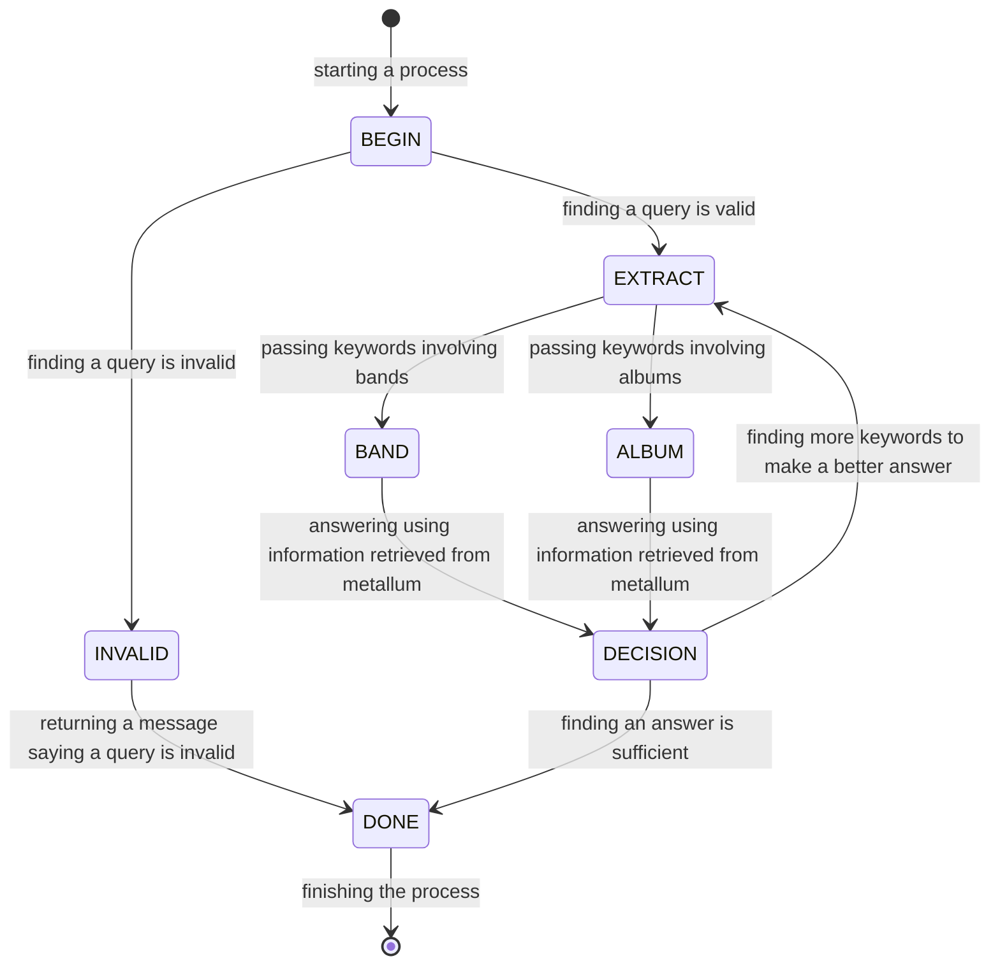

# MetalRag

A RAG system fetching information from metallum.

This is a demo to implement a rag system using [Groq](https://groq.com/).

## OK, Why do you code that?

LLMs can achieve noticeable results: they can answer to any questions!! However they cannot answer to questions containing what they don't know although they definitely have had a huge amount of trainings.... e.g. minor heavy metal bands! Furthermore, sometimes LLMs tell us a lie: They often say wrong members in a band. In such a case, LLMs are not helpful.

Since there are myriad of songs and genres in the heavy metal world, it is impossible even for LLMs to know everything in that world.

OK LLMs cannot cover everything. But thanks to enthusiastic heavy metal fans, we can get any information involving heavy metal from metal archive, known as [metallum](https://www.metal-archives.com/). Using the RAG technique, any questions about heavy metal can be answered.


## How should I execute codes??

Before executing, please get an [access key from Groq](https://console.groq.com/keys) and write that on `.env` file.

```
# In .env file
GROQ_API_KEY={YOUR GROQ API KEY}
```

Since this repository contains `pyproject.toml` file, using poetry the following commands work.


```sh
$ poetry install
$ poetry run python main.py
```

Then you would get an answer about megadeth and their album called "dystopia".

```
Question: please tell me about the album Dystopia

LLM: To provide a more accurate answer, more information is required. There are multiple bands with an album titled 'Dystopia', and it would be helpful to know which specific band or genre of metal you are referring to.

Could you provide more context or details, such as the band name or genre, to help narrow down the search and provide a more precise answer?

----------

Question: please tell me about the megadeth's album called Dystopia

LLM: Unfortunately, I don't have any information about the specific album "Dystopia" by Megadeth. However, I can try to fetch more information from the Metallum database.

After searching the database, I found the following information:

* Title: Dystopia
* Type: Full-length
* Release date: January 22, 2016
* Label: Tradecraft
* Genre: Thrash Metal

According to the information fetched from Metallum, Megadeth's album "Dystopia" was released in 2016 and is classified as a Thrash Metal album.
```

If you would like to know another band, please ask to the agent.

```python
print(agent.chat("please tell me about the band called EXIMPERITUSERQETHHZEBIBSIPTUGAKKATHSULWELIARZAXULUM."))
```

```
After searching for the band 'EXIMPERITUSERQETHHZEBIBSIPTUGAKKATHSULWELIARZAXULUM' on Metallum (the Heavy Metal Archives), I found that it's a Belarusian Funeral Doom band.

 EXIMPERITUSERQETHHZEBIBSIPTUGAKKATHSULWELIARZAXULUM was formed in 2009 and their music style is associated with the funeral doom and drone genres. Not much information is provided, I suggest visit metallum web for more information
```

### NOTE

Sometimes error occur in executing Groq API (e.g. function calling fails). Then please re-execute codes and that would leads to the success: you get an answer from LLM!

## How this RAG works?

A main idea is a state machine. Beginning with the initial state, a agent probes states and arrive at the end state. If an invalid question is given, a LLM recognizes that and the agent goes to the end state "DONE". Otherwise, information about bands and albums are fetched from metallum and a LLM checks a generated answer. If that answer seems enough to answer to the question, that answer is returned. The following represents the whole states and how those states are transitioned.



## What is remaining?

Although the mighty website, metallum, has great function like searching members in a certain band, this demo does't provide that. That is great (at least for me!) and may bring an unprecedented experience to us!